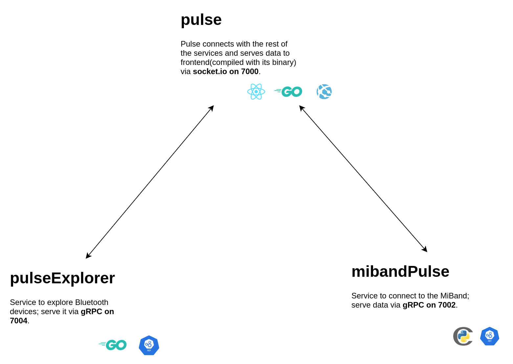

<h1 align="center">Pulse</h1>
<h5 align="center"> Simple Heartbeat Monitor :heart: :bar_chart:</h5>

 
 
 
  

  

**Pulse is a heartbeat monitor; it connects with your smart band and fetches your pulse in real-time to display it on a dashboard**. It currently supports MiBand 2 and 3, but support for more devices can be added.

>  This readme only contains the technical details about the project; the journal for this project can be found here with more information on design decisions, applications etc. 

# Index

- [About](#about)
- [Usage](#usage)
  - [Installation](#installation)
  - [Commands](#commands)
- [Development](#development)
  - [Pre-Requisites](#pre-requisites)
  - [Developmen Environment](#development-environment)
  - [File Structure](#file-structure)
  - [Build](#build)  
  - [Deployment](#deployment)  
- [Community](#community)
  - [Contribution](#contribution)
  - [Branches](#branches)
  - [Guideline](guideline)  
- [FAQ](#faq)
- [Resources](#resources)
- [Gallery](#gallery)
- [Acknowledgment](#acknowledgment)
- [License](#license)

# About

Pulse can be deployed on a Raspberry Pi, and some services under this project can also be embedded. Let's look at the underlying working of the pulse.

